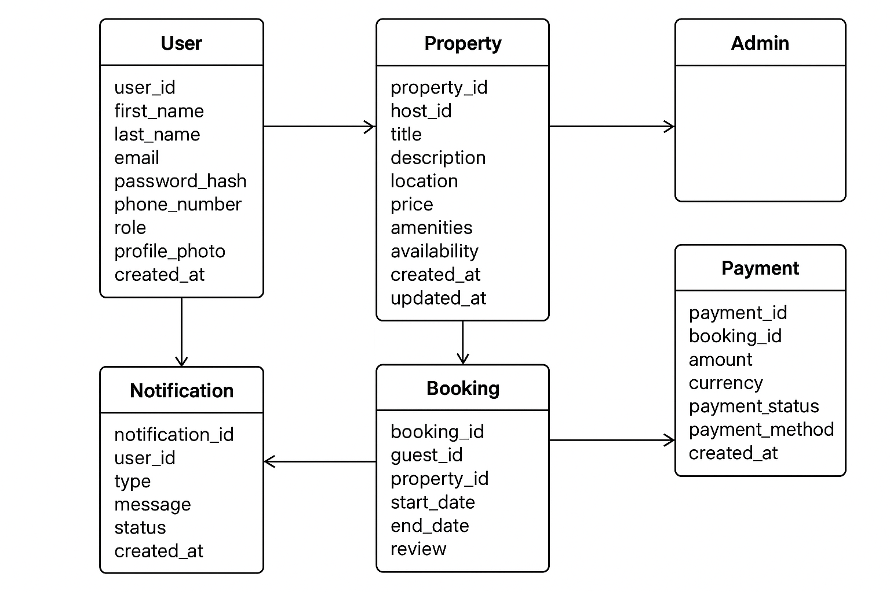

# Airbnb Clone Backend: Features & Functionalities

This document outlines the key features and functionalities required for the backend of the Airbnb Clone project. The backend enables a scalable, secure, and robust rental marketplace system.

## Core Functionalities

### 1. User Management
- **User Registration**
  - Sign up as a Guest or Host.
  - Secure authentication with JWT.
- **User Login**
  - Email/password login.
  - OAuth login (Google, Facebook).
- **Profile Management**
  - Update profile information, photos, and preferences.

### 2. Property Listings Management
- **Add Listings**
  - Hosts can create property listings with title, description, location, price, amenities, availability.
- **Edit/Delete Listings**
  - Hosts can update or remove listings.

### 3. Search and Filtering
- Search properties by:
  - Location
  - Price range
  - Number of guests
  - Amenities (Wi-Fi, pool, pet-friendly)
- Pagination for large datasets.

### 4. Booking Management
- **Booking Creation**
  - Guests can book properties for specified dates.
  - Prevent double bookings using date validation.
- **Booking Cancellation**
  - Guests or hosts can cancel bookings according to policy.
- **Booking Status**
  - Track status: pending, confirmed, canceled, completed.

### 5. Payment Integration
- Secure payment gateways (Stripe, PayPal)
- Support multiple currencies
- Automatic payouts to hosts

### 6. Reviews & Ratings
- Guests can leave reviews and ratings
- Hosts can respond to reviews
- Reviews linked to bookings to prevent abuse

### 7. Notifications System
- Email and in-app notifications for:
  - Booking confirmations
  - Cancellations
  - Payment updates

### 8. Admin Dashboard
- Monitor and manage:
  - Users
  - Listings
  - Bookings
  - Payments

---

## Technical Requirements

### 1. Database Management
- Relational database: PostgreSQL/MySQL
- Required tables:
  - Users
  - Properties
  - Bookings
  - Reviews
  - Payments

### 2. API Development
- RESTful API with HTTP methods (GET, POST, PUT/PATCH, DELETE)
- Optional GraphQL for complex data fetching

### 3. Authentication & Authorization
- JWT for secure sessions
- Role-Based Access Control (RBAC):
  - Guests
  - Hosts
  - Admins

### 4. File Storage
- Cloud storage for property images & profile photos (AWS S3, Cloudinary)

### 5. Third-Party Services
- Email notifications via SendGrid or Mailgun

### 6. Error Handling & Logging
- Global error handling
- Logging for monitoring API errors

---

## Non-Functional Requirements

### 1. Scalability
- Modular architecture
- Horizontal scaling with load balancers

### 2. Security
- Encryption for passwords & payment info
- Firewalls and rate limiting

### 3. Performance Optimization
- Caching (Redis) for frequently accessed data
- Optimized database queries

### 4. Testing
- Unit and integration testing
- Automated API testing

---

## Visual Representation

